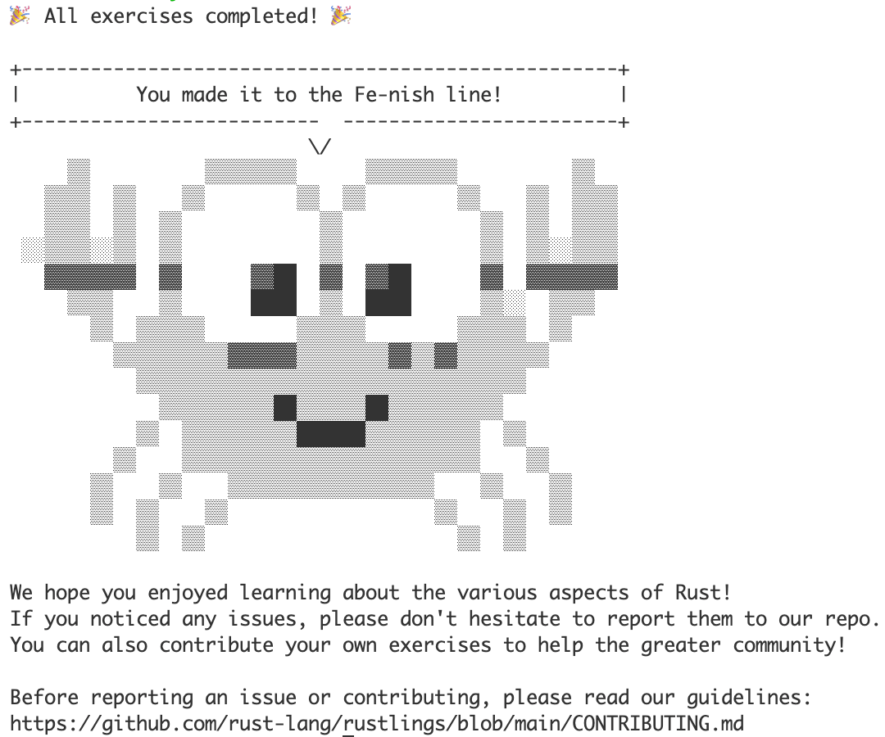

# Learn Rust with rustlings

This is an archive of solutions to rustlings exercises on commit `d57c1830280b2dbc1b9fe2ac3f48b51add591412` (aka version `4.6.0` ).

Refer to the [Original README](./README.old.md) for more details.

In case you get stuck, use to `rustlings hint`. You're a encouraged to ask questions.
